# Introduction

## Aim of the study
- Can personal (ego) networks empirically classified using **structural** characteristics?
     - Diameter (Largest Connected Component)
     - Density
     - Modularity (Louvain)
     - Centralization (Betweenness)
     - *Extensions*: Components, LCC Alter Share, Big Five Traits

## Previous Work: Bidart et al. (2018), *Social Networks*
- Supervised (Manual) Classification
- Younger Population
- French Context
- Their typology is meant to "produce structural measures of personal networks that are realistic and can be applied generally" (p. 2).

## Previous Work: Bidart et al. (2018), *Social Networks*
- Distinction between:
  - Attribute-based typologies
    - Role relation and demographic composition (e.g., kin/non-kin)
    - Support
  - Structural typologies
  - "Mixed" typologies
    - e.g., Gianella & Fischer (2016)

## Recent Benchmark: Vacca (2020), *Network Science*
- Systematic evaluation of structural typologies across six diverse datasets
- Introduced inductive subgroup method ($T_1$) using Girvan–Newman community detection:
  - Count of cohesive subgroups ($\ge 3$ nodes)
  - Count of singletons and dyads (1–2 nodes)
  - Subgroup modularity
- *Limitations*: Strictly cross-sectional snapshots; black-box $k$-medoids partitions without explicit decision tree cutoffs; no institutional nesting or psychological traits.

## Current Work
- Builds directly on Bidart et al. (2018) & Vacca (2020) while advancing beyond them:
  - **Longitudinal Panel**: 8 waves over 3 years; cumulative networks + Markov HMM transitions
  - **Transparent Decision Rules**: Empirical decision tree (92.9% accuracy) with explicit cutoffs
  - **Multilevel Institutional Nesting**: Crossed random effects for residence halls & majors
  - **Psychological Grounding**: Big Five personality dimensions Predicting structural sorting

# Data and Approach

## Data
- NetHealth Study
     - Sample of 709 Members of the Class of 2019 at the University of Notre Dame
- Eight Ego Network Survey Waves over three years
     - Administered at beginning and end of each semester
     - Fall (August) 2015 - Spring (May) 2018
- Built Cumulative Ego Networks for Study Participants
- Total number of ego-alter dyads: 35,912 
     - Average of about fifty alters per ego

## Ego Network Survey Approach
- Online Qualtrics Survey
- Name Generator:
     - *List up to 20 people with whom you spend time communicating or interacting*
- Name Interpreters:
     - Alter Sociodemographic characteristics (e.g., Gender, Race, Religion, etc.)
     - Relationship characteristics (e.g., Closeness, Role Relations, Duration, etc.)
- *Ego's report of whether two alters know one another*

## Analytic Sample
- Retain only participants with three or more alters
- Eliminated participants who reported no connections between alters
- Total analytic sample of egos: **701**

# Results

## Cumulative Ego Network Size Distribution
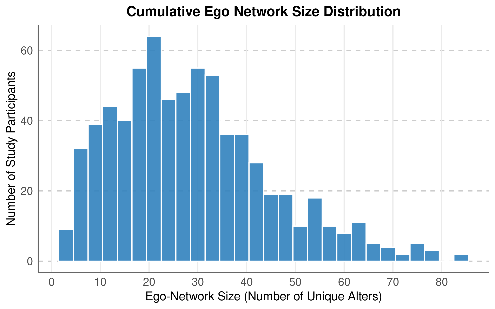

## Clustering Approach
- Standardized structural metrics:
     - Size, Modularity, Diameter, Betweenness Centralization, Density
- $k$-means clustering with four clusters successfully identifies the core typologies

## Cluster Profiles
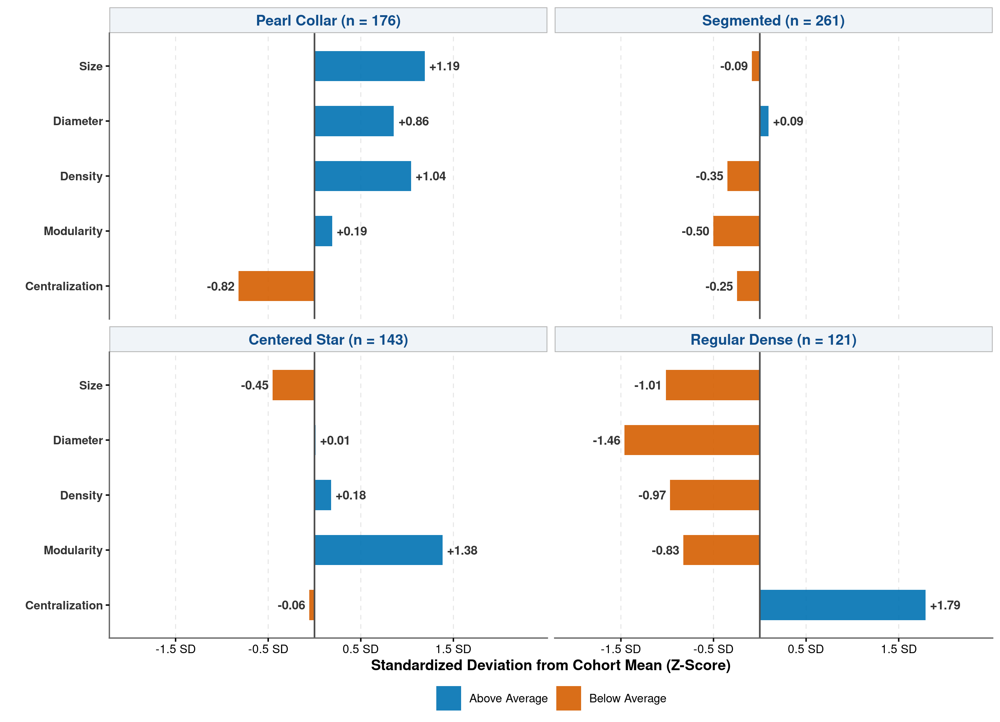

## Qualitative Summary of Cluster Analysis (Bidart et al.'s Labels)
| Cluster | Typology | Size | Diam. | Dens. | Mod. | Cent. |
| :--- | :--- | :---: | :---: | :---: | :---: | :---: |
| 0 | **Pearl Collar** | + | + | -- | + | + |
| 1 | **Segmented** | + | + | -- | + | -- |
| 2 | **Centered Star** | + | + | -- | -- | ++ |
| 3 | **(Small) Regular Dense** | -- | -- | ++ | -- | -- |

- Clear emergence of all 4 primary structural forms from the longitudinal data.

## Empirical Decision Tree Classification
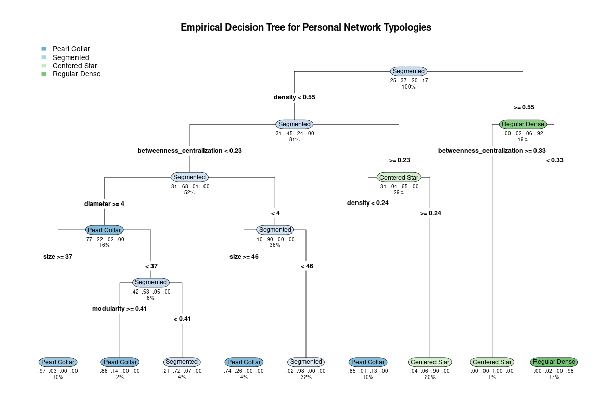

## Structural Cutoffs from Decision Tree
- **Regular Dense**: Alter-alter density $\ge 0.55$, low centralization ($< 0.33$).
- **Centered Star**: Alter-alter betweenness centralization $\ge 0.235$, moderate density.
- **Segmented**: Density $< 0.55$, centralization $< 0.235$, diameter $< 3.5$.
- **Pearl Collar**: High diameter ($\ge 3.5$), cumulative size $\ge 37$, high modularity.
- **Overall Classification Accuracy**: **92.9%**

## Clusters by Gender
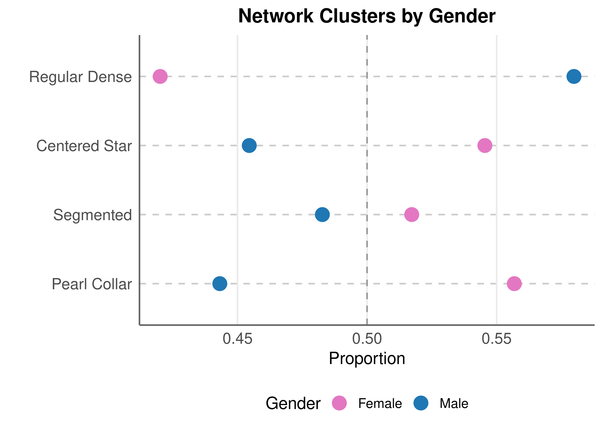

## Clusters by Gender: Model
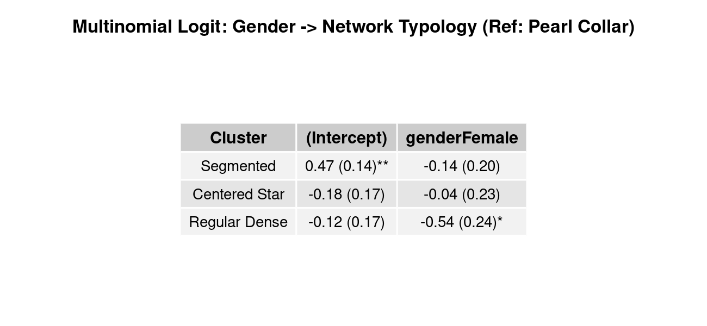

## Clusters by Gender: Interpretation
- In this context:
  - **Men**:
    - More likely to have smaller, denser, decentralized networks (*Regular Dense*)
  - **Women**: 
    - More likely to have larger, segmented networks centered on key intermediaries (*Pearl Collar* / *Centered Star*)

## Clusters by Ethnoracial ID: White
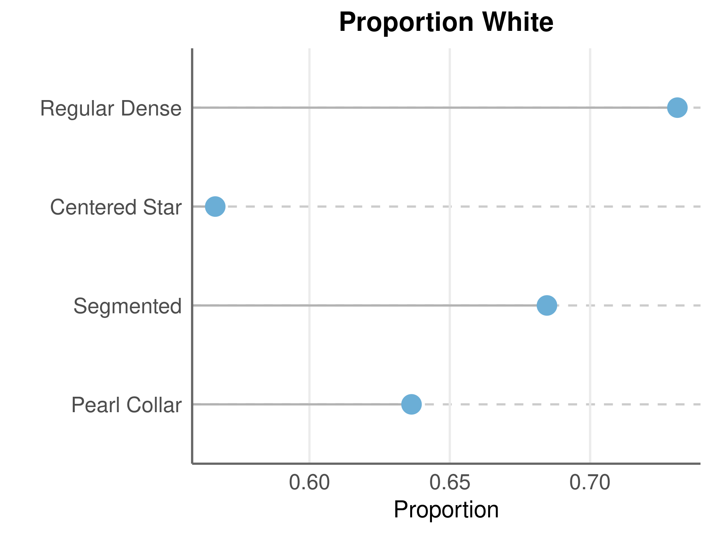

## Clusters by Ethnoracial ID: African-American
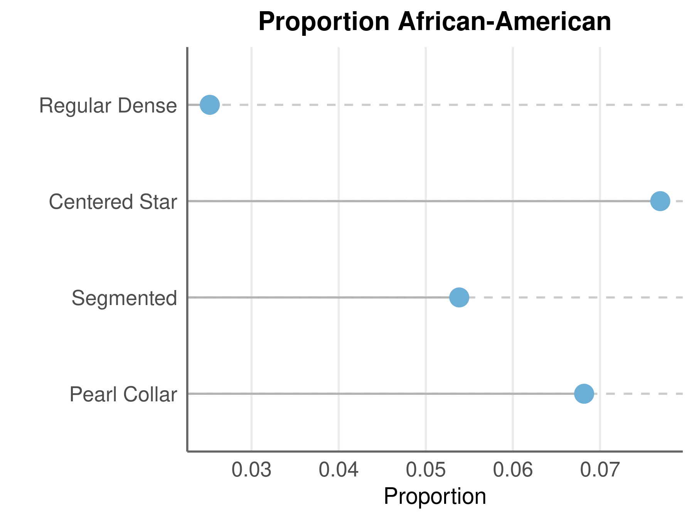

## Clusters by Ethnoracial ID: Latinx
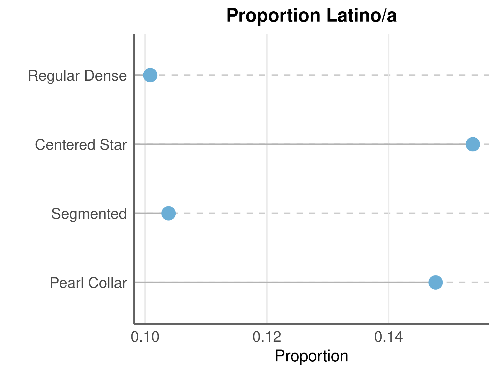

## Clusters by Ethnoracial ID: Asian-American
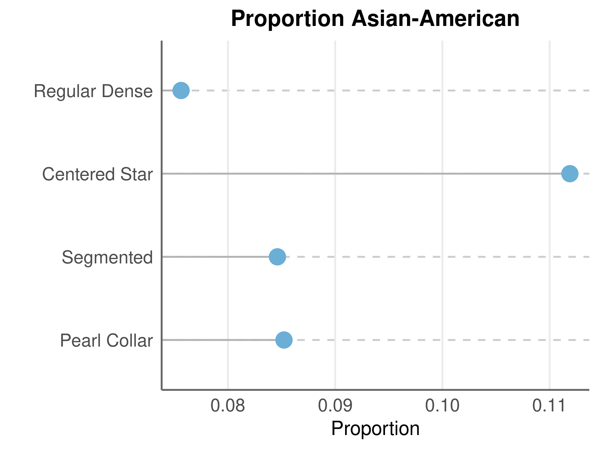

## Clusters by Ethnoracial ID: Foreign Student
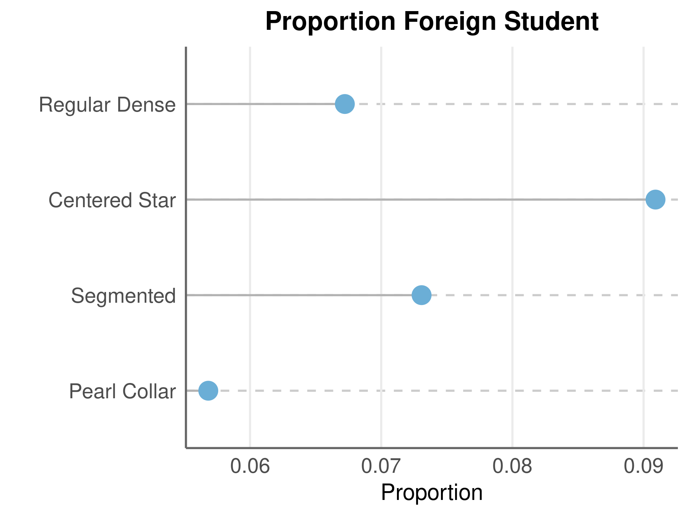

## Clusters by Ethnoracial ID: Model
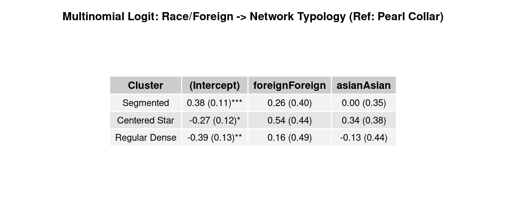

## Clusters by Ethnoracial ID: Summary
- In this elite college context:
  - Relatively modest differences across domestic ethnoracial groups.
  - **Foreign / International students**:
    - Significantly higher probability of having small, tightly knit, decentralized networks (*Regular Dense*).

## Clusters by Socio-Economic Status
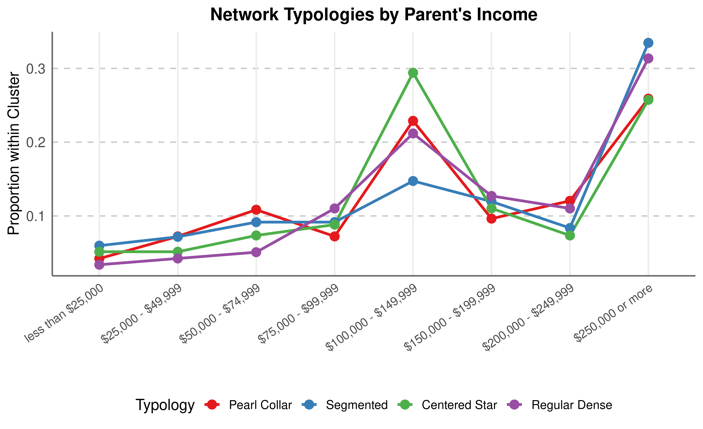

## Clusters by Socio-Economic Status: Model
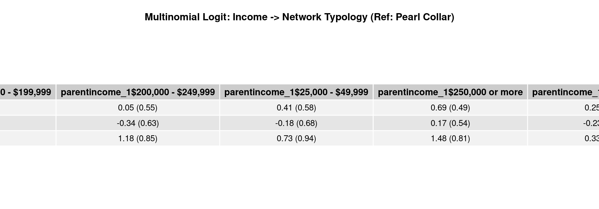

## Personality & Network Typology (Extension)
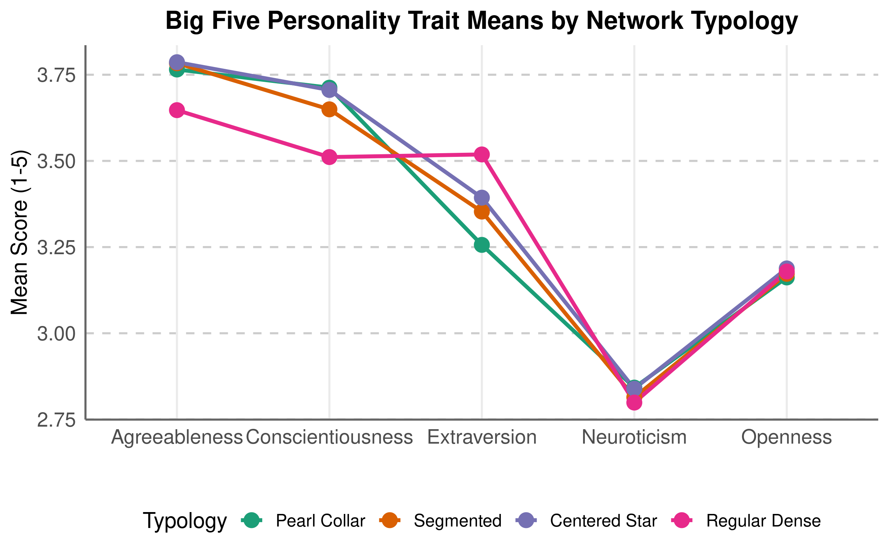

## Personality & Network Typology: Model
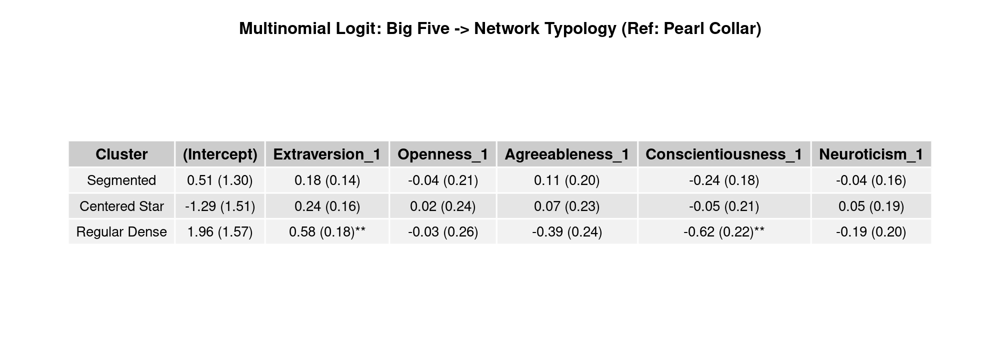

## Personality & Network Typology: Summary
- **Extraversion**: Strongly predicts membership in *Pearl Collar* and *Segmented* networks (larger reach and bridging across groups).
- **Agreeableness & Conscientiousness**: High in cohesive, cohesive *Regular Dense* clusters.
- **Neuroticism**: Slightly elevated in sparse, fragmented personal networks.

# Conclusion

## Summary of Findings
- Supervised typologies from French young adults (Bidart et al., 2018) replicate remarkably well in unsupervised clustering of U.S. college student ego networks.
- Decision trees provide explicit, data-driven cutoffs that accurately partition the structural forms (92.9% accuracy).
- Demographics, SES, and personality traits systematically sort individuals into distinct structural personal network regimes.
